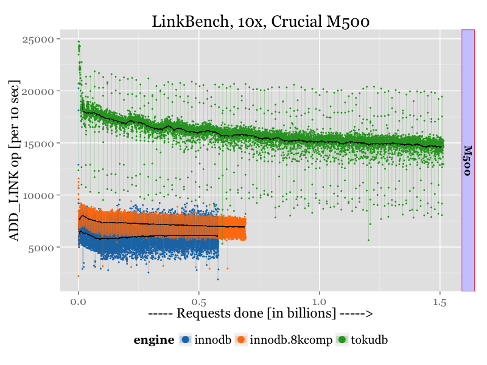
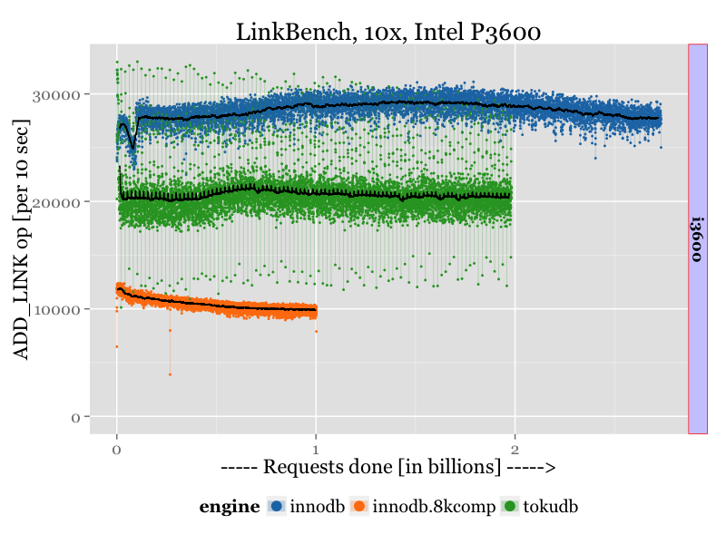
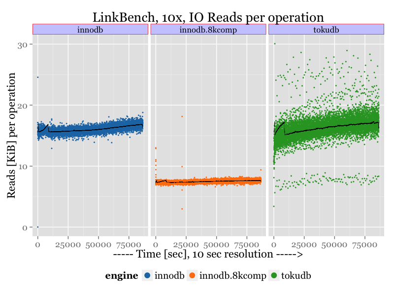
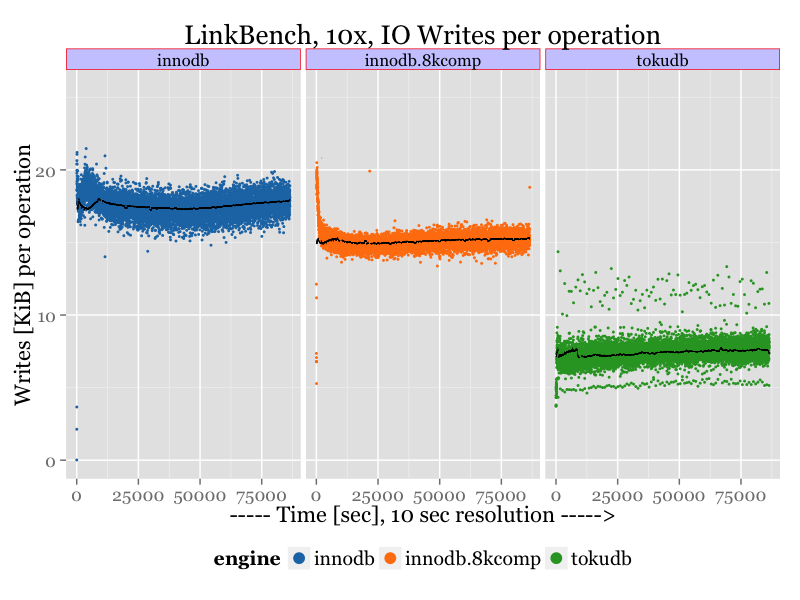

.. _linkbench-mysql-sm-perf01-jul2015:

================================
LinkeBench MySQL 
================================

Benchmark date: Jul 2015.

The goal was to evaluate storage engines for MySQL.
The workload is `LinkBenchX <https://github.com/Percona-Lab/linkbenchX>`_.
The load is designed to be heavy IO-load.

I compared InnoDB without compression, InnoDB with 8k compression, TokuDB with quicklz compression.

The benchmark was done on the server  :ref:`sm-perf01` with storage options:

* Intel P3600 PCIe SSD 1.6TB (marked as "i3600" on charts)
* Crucial M500 SATA SSD 900GB (marked as "M500" on charts)

Workload description
====================

* LinkBenchX
* Scale: 10x (100mln ID)
* Length: 1 day

Database Size
-------------
With the given scale factor loaded database takes this space:

========= ======= ===============
Engine    Size    Ratio to InnoDB
========= ======= ===============
InnoDB    115 GiB 1
InnoDB 8K 53 GiB  0.46
TokuDB    41 GiB  0.36
========= ======= ===============

Cache size
----------

* For InnoDB I used `innodb-buffer-pool-size=12G` in `O_DIRECT` mode, this gives about **1:10** ratio in memory size to datasize.
* For TokuDB I used `tokudb_cache_size=8G` with disabled DIRECTIO, though total available memory for TokuDB was limited to **12G** (via cgroups, `see cgroup blog post <https://www.percona.com/blog/2015/07/01/using-cgroups-to-limit-mysql-and-mongodb-memory-usage/>`_). The reason for that is to allow TokuDB to cache compressed pages in OS cache.

.. note:: For this benchmark I used the latest available Percona Server with TokuDB 7.5.8, which introduces new parameter `tokudb_fanout`.
	`See the release notes <https://www.percona.com/blog/2015/07/09/percona-server-5-6-25-73-1-is-now-available/>`_.

	For all TokuDB runs I use `tokudb_fanout=128`

Results on Crucial M500
=======================

Because during the benchmark the database grows, on charts I show throughput in the relation to total operation performed. This results in that charts for different engines have different length (depends on how many operations were done within 24h).
Black lines on charts are not actual results, but rolling averages, to show a trend.

Results:
--------

The graph shows ADD_LINK operations done per 10 sec (more is better).

Or average results at the end of benchmark (throughput, ADD_LINK operations per 10 seconds):

========= ===========================
Engine    Throughput [ADD_LINK/10sec]
========= ===========================
InnoDB    6029
InnoDB 8K 6911
TokuDB    14633 
========= ===========================

There TokuDB outperforms InnoDB almost two times, but also shows a great variance in results, which I correspond to a checkpoint activity.

Results on Intel P3600
======================

The identical run as above, but as storage we used Intel P3600 PCIe SSD

Results:
--------

The graph shows ADD_LINK operations done per 10 sec (more is better).

Or average results at the end of benchmark (throughput, ADD_LINK operations per 10 seconds):

========= ===========================
Engine    Throughput [ADD_LINK/10sec]
========= ===========================
InnoDB    27739
InnoDB 8K 9853
TokuDB    20594 
========= ===========================

On the fast storage InnoDB (without compression) is unbeatable and shows the best result.
 
To understand the reasoning why InnoDB shines on fast storage let's review IO usage by all engines.

IO usage
========

Reads
-----

Following chart shows Reads in KiB, that engines, in average, performs for a request from client.

Writes
------

Following chart shows Writes in KiB, that engines, in average, performs for a request from client.

There we can make interesting observations that TokuDB in average performs two times less writes than InnoDB,
and this is what allows TokuDB to be better on slow storages.
On a fast storage, where there is no performance penalty on many writes, InnoDB is able to get ahead,
as InnoDB is still better in using CPUs.

Though, it worth to remember, that:

* on fast expensive storage, TokuDB provides a **better compression**, which allows to store more data in limited capacity
* TokuDB still writes two time less than InnoDB, that mean twice longer lifetime for SSD (still expensive).

Also looking on results, I can make a conclusion that InnoDB compression is inefficient in its implementation,
as it is not able to get befits: first, from doing less reads (well, it helps to get better than uncompressed InnoDB, but not much); and, second, from a fast storage.

Appendix
========

InnoDB config
-------------

.. code-block:: bash

	innodb-flush-method            = O_DIRECT
	innodb-log-files-in-group      = 2
	innodb-log-file-size           = 16G
	innodb-flush-log-at-trx-commit = 1
	innodb_log_compressed_pages     =0
	innodb_log_checksum_algorithm  = crc32

	innodb-file-per-table          = 1
	innodb-buffer-pool-size        = 12G

	innodb_write_io_threads        = 8
	innodb_read_io_threads         = 32
	innodb_open_files              = 1024

	innodb_old_blocks_pct           =10
	innodb_old_blocks_time          =2000

	innodb_checksum_algorithm 		= crc32

	innodb_file_format              =Barracuda

	innodb_io_capacity 				=2000
	innodb_io_capacity_max			=5000
	metadata_locks_hash_instances	=256
	innodb_max_dirty_pages_pct		=90
	innodb_flush_neighbors			=0
	innodb_buffer_pool_instances	=16
	innodb_lru_scan_depth			=4096
	innodb_sync_spin_loops			=30
	innodb-purge-threads			=16

TokuDB config
-------------

.. code-block:: bash

	tokudb_cache_size		=8G
	tokudb_directio			=OFF
	tokudb_empty_scan		=disabled
	tokudb_read_block_size	=16K
	tokudb_commit_sync		=ON
	tokudb_checkpointing_period=900
	tokudb_block_size 		=4M
	tokudb_cleaner_iterations=10000
	tokudb_fanout			=128

LinkBenchX parameters
---------------------

	``bin/linkbench -r -c config/LinkConfigMysql.properties -D requesters=48 -D requestrate=45000 -D dbid=$DB -D maxtime=86400``

Raw results and scripts
=======================

The raw results and scripts `are available here <https://github.com/Percona-Lab/benchmark-results/tree/linkbench-mysql-sm-perf01-jul2015>`_

.. rubric:: Footnotes

