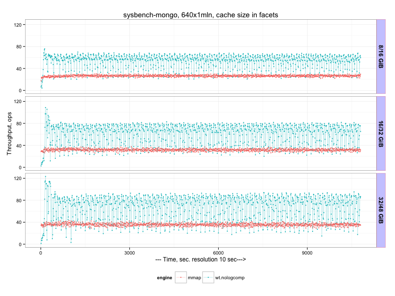
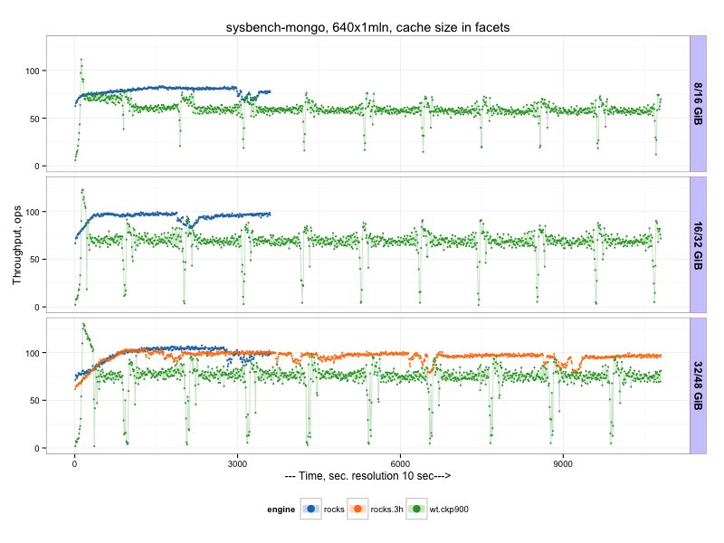
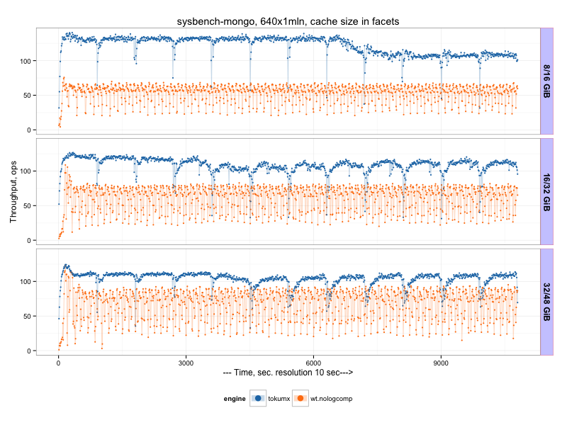
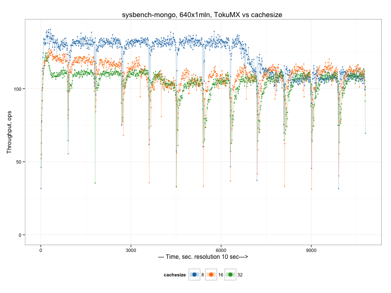
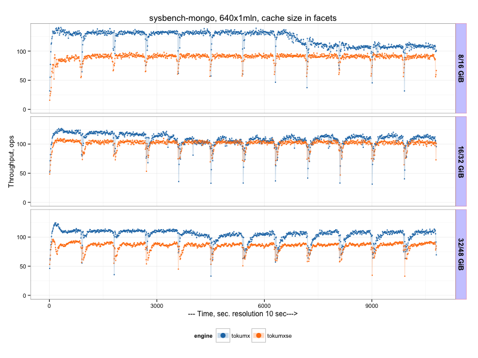
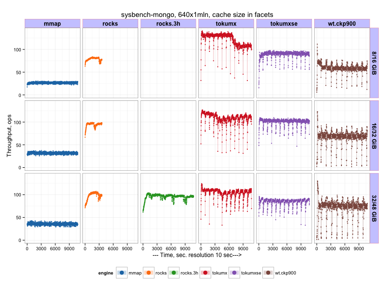

.. _mongodb-sysbench-hppro2:

================================
MongoDB sysbench-mongo benchmark
================================

Benchmark date: Jun 2015.

The goal was to evaluate different available storage engines for MongoDB.
The workload is `sysbench-mongodb <https://github.com/tmcallaghan/sysbench-mongodb>`_.
The load is designed to be a heavy IO-load, and I use a slow storage.

The benchmark was done on the server  :ref:`hppro2-server` with RAID10 over 6 SAS hard drives as a storage

Workload description
====================
* NUM_COLLECTIONS=640
* NUM_DOCUMENTS_PER_COLLECTION=1000000
* NUM_WRITER_THREADS=64
* RUN_TIME_MINUTES=180 (in some cases 60)

This gives about ~250GB of data for MMAP engines (uncompressed).
I use small cache sizes and limit total available memory available for mongod process via cgroups
`see cgroup blog post <https://www.percona.com/blog/2015/07/01/using-cgroups-to-limit-mysql-and-mongodb-memory-usage/>`_

So I use following cache/total memory configurations:

* 8GB cache / 16GB total
* 16GB cache / 32GB total
* 32GB cache / 48GB total

For MMAP engine there is no cache configuration, so only total memory limit is applied.

I use prolonged runs (1h or 3h) with measurements every 10sec to see long-term patterns and trends.

I use my binaries for MongoDB which includes RocksDB storage engine `link to binaries <http://percona-lab-mongorocks.s3.amazonaws.com/mongo-rocks-3.0.4-pre-STATIC.tar.gz>`_

MMAP vs WiredTiger
==================

MongoDB MMAP startup command line

	``$MONGODIR/mongod --dbpath=$DATADIR --logpath=$1/server.log``

MongoDB wiredTiger startup command line

	``$MONGODIR/mongod --dbpath=$DATADIR --storageEngine=wiredTiger --wiredTigerCacheSizeGB=X --wiredTigerJournalCompressor=none --logpath=$1/server.log``

Results:
--------

The graphical results to see the pattern (throughput is shown, in operations per second, more is better)

Or average results (throughput, operations per second) during 2nd hour:

=====  ==== ==========
size   mmap wiredTiger
=====  ==== ==========
8/16   26   53
16/32  31   61
32/48  35   67
=====  ==== ==========

RocksDB vs WiredTiger
=====================

MongoDB RocksDB startup command line

	``$MONGODIR/mongod --dbpath=$DATADIR --storageEngine=rocksdb --rocksdbCacheSizeGB=X``

Most runs for RocksDB was 60 min, plus one extra run for 180 min.

Or average results (throughput, operations per second) during 2nd hour:

=====  ==== ========== ========
size   mmap wiredTiger RocksDB
=====  ==== ========== ========
8/16   26   53         81
16/32  31   61         91
32/48  35   67         104 
=====  ==== ========== ========

TokuMX vs WiredTiger
====================

I use Percona TokuMX 2.0.1 in this test.

Percona TokuMX startup command line

	``$MONGODIR/mongod --dbpath=$DATADIR --setParameter="defaultCompression=quicklz" --setParameter="defaultFanout=128" --setParameter="defaultReadPageSize=16384" --setParameter="fastUpdates=true" --cacheSize=X --checkpointPeriod=900``

There we can see that TokuMX outperforms wiredTiger, but worth to note there is periodical drops in the throughput (every 900 sec, which corresponds to checkpointPeriod). What is problematic is that TokuMX throughput does not grow with cacheSize increase, which is the case for other engines. So it seems TokuMX does not benefit from extra available memory.

There is a chart only for TokuMX with cachesize comparison

Or average results (throughput, operations per second):

=====  ==== ========== ======== =========
size   mmap wiredTiger RocksDB  TokuMX
=====  ==== ========== ======== =========
8/16   26   53         81       106
16/32  31   61         91       107
32/48  35   67         104      102
=====  ==== ========== ======== =========

TokuMXse vs TokuMX
====================

In the last comparison I test TokuMXse RC6 (storage engine based on TokuFT for MongoDB 3.0)

TokuMXse command line
	
	``$MONGODIR/mongod --dbpath=$DATADIR --storageEngine=tokuft --tokuftCollectionReadPageSize=16384 --tokuftCollectionCompression=quicklz --tokuftCollectionFanout=128 --tokuftIndexReadPageSize=16384 --tokuftIndexCompression=quicklz --tokuftIndexFanout=128 --tokuftEngineCacheSize=X``	
	

We see there is a significant regression in the current TokuMXse RC6, the reason is that MongoDB 3.0 API does not allow us to utilize all TokuFT features, and we still need to find a workaround.

Or average results (throughput, operations per second):

=====  ==== ========== ======== ========= ========
size   mmap wiredTiger RocksDB  TokuMX    TokuMXse
=====  ==== ========== ======== ========= ========
8/16   26   53         81       106       57
16/32  31   61         91       107       76
32/48  35   67         104      102       63
=====  ==== ========== ======== ========= ========

And there is a final matrix with all results:

