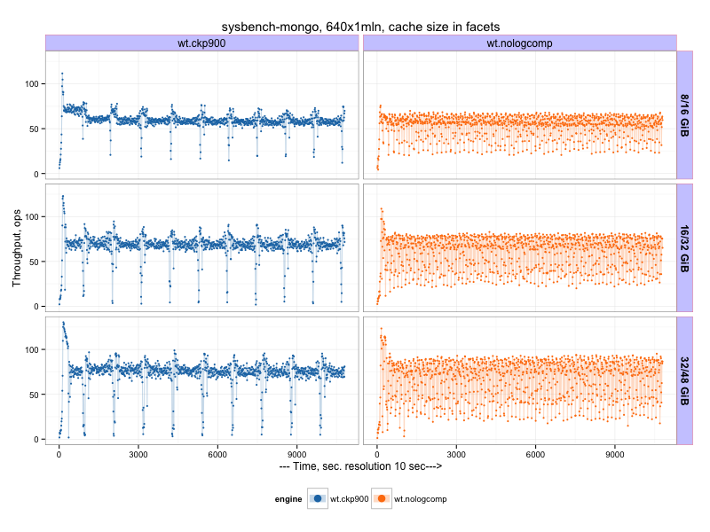
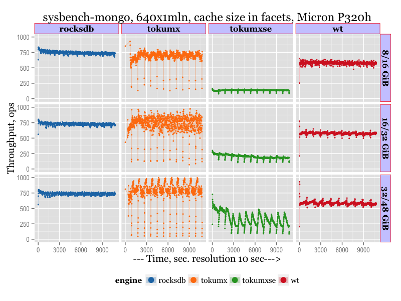
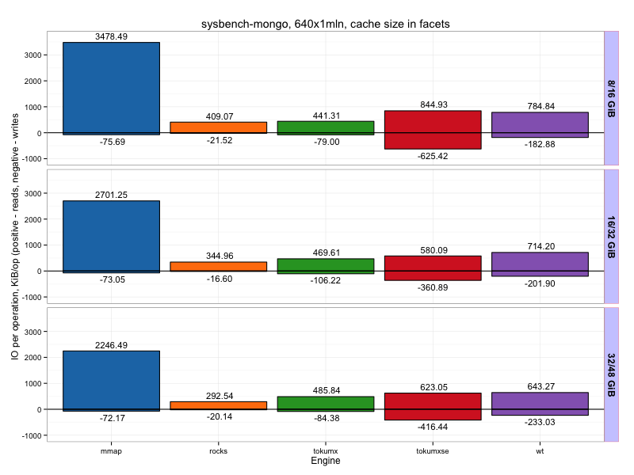

.. _mongodb-sysbench-hppro2:

================================
MongoDB sysbench-mongo benchmark
================================

Benchmark date: Jun 2015.

The goal was to evaluate different available storage engines for MongoDB.
The workload is `sysbench-mongodb <https://github.com/tmcallaghan/sysbench-mongodb>`_.
The load is designed to be a heavy IO-load, and I use a slow storage.

The benchmark was done on the server  :ref:`hppro2-server` with RAID10 over 6 SAS hard drives as a storage

Workload description
====================
* NUM_COLLECTIONS=640
* NUM_DOCUMENTS_PER_COLLECTION=1000000
* NUM_WRITER_THREADS=64
* RUN_TIME_MINUTES=180 (in some cases 60)

This gives about ~250GB of data for MMAP engines (uncompressed).
I use small cache sizes and limit total available memory available for mongod process via cgroups
`see cgroup blog post <https://www.percona.com/blog/2015/07/01/using-cgroups-to-limit-mysql-and-mongodb-memory-usage/>`_

So I use following cache/total memory configurations:

* 8GiB cache / 16GiB total
* 16GiB cache / 32GiB total
* 32GiB cache / 48GiB total

For MMAP engine there is no cache configuration, so only total memory limit is applied.

I use prolonged runs (1h or 3h) with measurements every 10sec to see long-term patterns and trends.

I use my binaries for MongoDB which includes RocksDB storage engine `link to binaries <http://percona-lab-mongorocks.s3.amazonaws.com/mongo-rocks-3.0.4-pre-STATIC.tar.gz>`_

MMAP vs WiredTiger
==================

MongoDB MMAP startup command line

.. code-block:: bash

	$MONGODIR/mongod --dbpath=$DATADIR --logpath=$1/server.log

MongoDB wiredTiger startup command line

.. code-block:: bash

	$MONGODIR/mongod --dbpath=$DATADIR --storageEngine=wiredTiger \
	--wiredTigerCacheSizeGB=X --wiredTigerJournalCompressor=none 

Results:
--------

The graphical results to see the pattern (throughput is shown, in operations per second, more is better)

.. image:: img/wt-mmap.png
	:width: 800px
	:height: 600px

Or average results (throughput, operations per second) during 2nd hour:

=====  ==== ==========
size   mmap wiredTiger
=====  ==== ==========
8/16   26   53
16/32  31   61
32/48  35   67
=====  ==== ==========

WiredTiger checkpoint period
============================

On previous chart we see a lot of variance in wiredTiger results. My guess was it is related to checkpointing activity,
which by default happens every 60. It took some research to find a way to change a checkpoint period for wiredTiger,
apparently the variable ``--syncdelay`` is responsible for that.
So there is results with longer (900sec) checkpoint interval for wiredTiger

Or average results (throughput, operations per second) during 2nd hour:

=====  ==== ========== ==============================
size   mmap wiredTiger wiredTiger (checkpoint 900sec)
=====  ==== ========== ==============================
8/16   26   53         58
16/32  31   61         67
32/48  35   67         72
=====  ==== ========== ==============================

So we can make a conclusion that increasing checkpoint interval makes some improvement in the variance, and the overall result is better (though dips in throughput is worse during checkpoint activity).
I will use the last result (with checkpoint period 900) in the following tables.

RocksDB vs WiredTiger
=====================

MongoDB RocksDB [#f1]_ startup command line

.. code-block:: bash

	$MONGODIR/mongod --dbpath=$DATADIR --storageEngine=rocksdb \
	--rocksdbCacheSizeGB=X

Most runs for RocksDB was 60 min, plus one extra run for 180 min.

.. image:: img/wt-rocksdb.png
	:width: 800px
	:height: 600px

Or average results (throughput, operations per second) during 2nd hour:

=====  ==== ========== ========
size   mmap wiredTiger RocksDB
=====  ==== ========== ========
8/16   26   58         81
16/32  31   67         91
32/48  35   72         104 
=====  ==== ========== ========

TokuMX vs WiredTiger
====================

I use Percona TokuMX 2.0.1 [#f2]_ in this test.

Percona TokuMX startup command line

.. code-block:: bash

	$MONGODIR/mongod --dbpath=$DATADIR --setParameter="defaultCompression=quicklz" \
	--setParameter="defaultFanout=128" --setParameter="defaultReadPageSize=16384" \
	--setParameter="fastUpdates=true" --cacheSize=X --checkpointPeriod=900

.. image:: img/wt-tokumx.png
	:width: 800px
	:height: 600px

There we can see that TokuMX outperforms wiredTiger, but worth to note there is periodical drops in the throughput (every 900 sec, which corresponds to checkpointPeriod). What is problematic is that TokuMX throughput does not grow with cacheSize increase, which is the case for other engines. So it seems TokuMX does not benefit from extra available memory.

There is a chart only for TokuMX with cachesize comparison

.. image:: img/tokumx-cache.png
	:width: 800px
	:height: 600px

Or average results (throughput, operations per second):

=====  ==== ========== ======== =========
size   mmap wiredTiger RocksDB  TokuMX
=====  ==== ========== ======== =========
8/16   26   58         81       107
16/32  31   67         91       107
32/48  35   72         104      102
=====  ==== ========== ======== =========

TokuMXse vs TokuMX
====================

In the last comparison I test TokuMXse RC6 [#f3]_ (storage engine based on TokuFT for MongoDB 3.0)

TokuMXse command line

.. code-block:: bash

	$MONGODIR/mongod --dbpath=$DATADIR --storageEngine=tokuft \
	--tokuftCollectionReadPageSize=16384 --tokuftCollectionCompression=quicklz \
	--tokuftCollectionFanout=128 --tokuftIndexReadPageSize=16384 \
	--tokuftIndexCompression=quicklz --tokuftIndexFanout=128 \
	--tokuftEngineCacheSize=X --syncdelay=900
	
.. image:: img/tokumxse.png
	:width: 800px
	:height: 600px

We see there is a significant regression in the current TokuMXse RC6, the reason is that MongoDB 3.0 API does not allow us to utilize all TokuFT features, and we still need to find a workaround.

Or average results (throughput, operations per second):

=====  ==== ========== ======== ========= ========
size   mmap wiredTiger RocksDB  TokuMX    TokuMXse
=====  ==== ========== ======== ========= ========
8/16   26   58         81       107       89
16/32  31   67         91       107       100
32/48  35   72         104      102       84
=====  ==== ========== ======== ========= ========

And there is a final matrix with all results:

.. image:: img/matrix.png
	:width: 800px
	:height: 600px

Results on a fast storage (pure flash)
======================================

(updated on 07/15/2015 with the results on pure flash, Micron RealSSD P320h)

There is a matrix with results on a fast storage, PCIe Flash, Micron RealSSD P320h. All other conditions as descibed above.

IO Resources consumption
========================

Beside the plain throughput, it is interesting to compare how much IO resources different engines consume.
As all engines show different throughput, I normalize IO reads and writes per operation. The result is on the next chart. The chart show Reads in KiB per operation (above 0) and Writes in KiB per operation (shown below 0).

It is naturally to expect that reads per operation should go down with bigger cachesize, and most engines perform this way (beside TokuMX and TokuMXse).
In writes area RocksDB is absolute winner, it is almost magical how little writes per operation it performs.

Final words
===========
At the end I would like to highlight that this benchmark was designed to emulate a heavy IO load on (relatively) slow IO subsystem.
This use case, I believe, is totally valid and represent frequently used "cloud" setups, with limited memory and slow IO.
WiredTiger engine, as B-Tree based, is expected to perform worse comparing to RocksDB and Toku Fractal Trees, which, are designed to handle IO-intensive workloads. My assumption is that wiredTiger will perform better (or even outperform others) for CPU intensive in-memory workloads(see for example  `Mark Callaghan's results <http://smalldatum.blogspot.com/2015/07/linkbench-for-mysql-mongodb-with-cached.html>`_). Also WiredTiger is expected to perform better on a faster storage.

Raw results and scripts
=======================

The raw results and scripts `are available here <https://github.com/Percona-Lab/benchmark-results/tree/mongo-sysbench-hdpro2-hdd-jun2015>`_

.. rubric:: Footnotes

.. [#f1] Link to download `MongoDB with RocksDB <http://percona-lab-mongorocks.s3.amazonaws.com/mongo-rocks-3.0.4-pre-STATIC.tar.gz>`_ .

.. [#f2] `Percona TokuMX 2.0.1 <http://www.tokutek.com/tokumx-for-mongodb/download-community/>`_

.. [#f3] `Percona TokuMXse RC6 <https://www.percona.com/downloads/TESTING/percona-tokumxse/percona-tokumxse-3.0.3-1.0-rc.6/>`_

